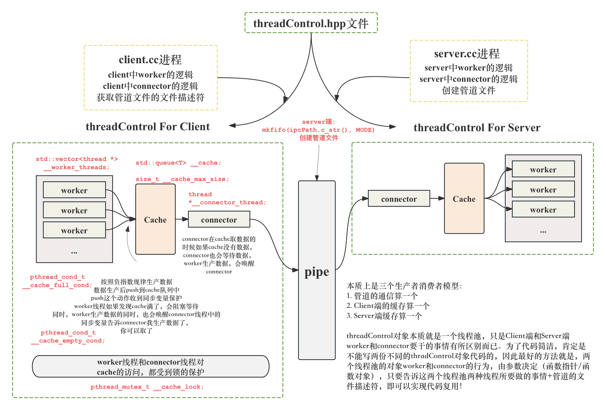

# 基于双线程池的管道通信系统框架

- [简体中文](./README-CN.md)
- [English](./README.md)


***

- [基于双线程池的管道通信系统框架](#基于双线程池的管道通信系统框架)
  - [复用本项目的线程池方法](#复用本项目的线程池方法)
  - [项目基本信息](#项目基本信息)
  - [项目可以优化的方向](#项目可以优化的方向)
  - [系统整体架构](#系统整体架构)
  - [项目实现效果](#项目实现效果)
    - [项目运行方式](#项目运行方式)
    - [不同lambda参数组合实验及其分析](#不同lambda参数组合实验及其分析)
  - [threadControl对象详细设计](#threadcontrol对象详细设计)
    - [Q: 为什么threadControl对象在这个版本上，只能用std::string作为数据？其他类型为什么暂时还不行？](#q-为什么threadcontrol对象在这个版本上只能用stdstring作为数据其他类型为什么暂时还不行)
    - [整体设计](#整体设计)
    - [threadControl的成员变量](#threadcontrol的成员变量)
    - [threadControl的成员函数](#threadcontrol的成员函数)
      - [run()方法](#run方法)
      - [get\_task()方法](#get_task方法)
      - [其他方法](#其他方法)
  - [server/client的worker/connector](#serverclient的workerconnector)
    - [server](#server)
    - [client](#client)
  - [lockGuard.hpp RAII风格的锁封装](#lockguardhpp-raii风格的锁封装)
  - [Log.hpp 封装](#loghpp-封装)
  - [comm.hpp](#commhpp)

## 复用本项目的线程池方法

本项目的线程池组建（threadControl.hpp）对象具有高维护性和高代码可读性，除了在这项目中能用之外，很其他项目，这个组建都可以做为线程池使用。

大家可以直接查看调用方法的文档。

- **[reuse-the-threadpool.md](./docs/reuse-the-threadpool-CN.md)**

## 项目基本信息

本项目从零开始实现了一个基于双线程池的管道通信系统框架，本质上是进程之间的通信。

**具体实现如下：**

- 客户端和服务端的通信，客户端随机产生数据，三个生产者 线程(数量可以通过参数设定)，一个管道线程。生产者线程生产数据后，push 到客户端的缓冲区 中，等待管道线程获取，并推送到管道中。客户端数据通过管道发送给服务端进程，服务端也有三个（数量可以通过参数设定）消费线程，一个管道线程，管道线程接受管道中的数据后，push 到服务端维护的缓冲区中，分发给消费线程进行消费。
- 生产和消费按照负指数规律进行，参数 lambda 通过两个进程的命令行传参指定。
- 通过 RAII 风格，手动封装互斥锁，并手动封装 lockGuard 对象，方便加锁和解锁，提高代码可读性，提高解耦性。见`./Utils/lockGuard.hpp`。
- 生产者产生的数据需要带有进程标签和线程标签，因此手动封装原生线程`pthread_t`为`thread`对象，其中可以包括包含线程信息，线程名字等其他信息，方便线程的管理和提高代码的 可读性。见`./Utils/thread.hpp`。
- 封装日志功能`./Utils/Log.hpp`，区分日志的等级。方便debug和调试。
- 封装该项目的核心对象`class thread_control`。本质上是线程池。客户端和服务端均可复用这个对象 的代码，管理所需要的线程，和线程所对应需要做的函数回调。与此同时，可以实现在一份代码中，管理所有线程(客户端或服务端)所有的互斥锁和互斥同步变量。**这个对象我认为是本次项目的核心 所在，它可以避免在客户端进程和服务端进程中，分别编写控制线程的逻辑，使得线程控制的逻辑从 客户端和服务端中解耦出来，大大减少代码的冗余，大大提高了代码的二次开发潜力。具体核心实现 可以见图 1 和文章第一大章节的描述。见`./Utils/threadControl.hpp`。**

## 项目可以优化的方向

我欢迎各位对我本项目进行持续的优化，如果要对本项目进行优化，大家可以联系我的邮箱（我的主页上有）之后，fork本仓库进行优化，如果我认为这个优化是ok的，我会进行merge操作的！

- connector线程目前只有一个，可以进行优化，connector线程通过参数进行设定。
- 可以优化使得connector线程结合多路转接技术，具体可以见我另一个仓库，[Multiplexing-high-performance-IO-server](https://github.com/Yufccode/Multiplexing-high-performance-IO-server)，同时监听多个文件描述符，这个文件描述符不止来自于管道，还可以来自于网络，来自于硬件等等，因此本项目是可以持续优化的！
- 优化线程池支持的数据类型，目前只支持string类型，因为目前来说，我还没有编写序列化，反序列化的代码，因此只支持string/char*类型。如果本项目要扩展到网络服务器上，或者其他地方，都需要编写反序列化和序列化的代码，维护一个Task类，Task类可以序列化反序列化。同时Task类可以重载operator()方法，表示Task任务的执行和调用。

## 系统整体架构



## 项目实现效果

### 项目运行方式

克隆仓库。

```bash
git clone https://github.com/Yufccode/Dual-Thread-Pool-Based-Pipeline-Communication-System-Framework.git
```

进入目录。

```bash
cd Dual-Thread-Pool-Based-Pipeline-Communication-System-Framework
```

编译。

执行`make`或者`make all`，均可以同时生成`./Client/client`可执行文件和`./Server/server`可执行文件。 执行`make client`或者`make server`会分别生成 `client` 和 `server` 的可执行文件。
执行 `make clean` 会清理所有可执行文件。

```bash
make clean; make
```

编译好之后，开启两个终端，分别进入 Server 目录和 Client 目录。运行的时候要指定负指数生产/消 费的参数，否则程序也是不能正常运行的。如图 3 所示。与此同时，因为管道是 server 创建的，所以要先 运行 server 进程，才能运行 client 进程。


运行server或client需要传递lambda参数。

### 不同lambda参数组合实验及其分析

- **[diff_lambda_test-CN.md](./docs/diff_lambda_test-CN.md)**


## threadControl对象详细设计

### Q: 为什么threadControl对象在这个版本上，只能用std::string作为数据？其他类型为什么暂时还不行？

管道传输本质就是字符的传输，在这个版本的实现中，只用std::string对象可以很方便的转化成字符串。

想要把这个项目扩展到多种数据类型，需要对数据进行一层封装，数据本质是任务，可以封装成`Task`类，这个`Task`类需要重载`operator()`方法，表示任务的处理。

最重要的，需要添加序列化和反序列化的方法，将结构化的Task类转化成字符串类型，可以手动编写，也可以使用现在比较常用的方法：json或者protobuf。

**这个也是本项目可以继续优化的地方。**

### 整体设计

如图所示。


### threadControl的成员变量

本质是一个线程池，成员函数如下所示。**核心：一把锁+两把同步变量。**

```cpp
// 线程池本质就是一个生产者消费者模型
template <class T>
class thread_control
{
private:
    std::vector<thread *> __worker_threads;           // worker线程
    int __thread_num;                                 // worker线程数量
    std::queue<T> __cache;                            // 任务队列->也就是20个slot的缓冲区
    size_t __cache_max_size = CACHE_MAX_SIZE_DEFAULT; // 缓冲区最大的大小
    pthread_mutex_t __cache_lock;                     // 多个线程访问缓冲区的锁
    pthread_cond_t __cache_empty_cond;                // 判断缓冲区是否为空
    pthread_cond_t __cache_full_cond;                 // 判断缓冲区是否满了
    thread *__connector_thread;                       // connector线程，只有一个
    int __fd;                                         // 管道文件的fd
    double __lambda;                                  // 负指数参数，消费频率/生产频率
public:
    bool __quit_signal = false; // 控制进程结束
    // member functions
}
```

- `std::vector<thread *> __worker_threads;` 表示一系列的worker线程，如果是生产者对它进行的调用，那么这个几个线程就负责生产数据，然后丢到生产者维护的缓存中(`std::queue<T> __cache;`)。
- `int __thread_num;`表示worker线程的数量，这个参数由构造函数传递进来进行初始化。
- `size_t __cache_max_size = CACHE_MAX_SIZE_DEFAULT;` 缓冲区的最大的大小，`CACHE_MAX_SIZE_DEFAULT`在comm.hpp中定义。
- 一把锁+两把同步变量。每个tc对象维护一把锁，用来保护缓冲区的多线程访问，因为worker线程有多个，而且connector线程也会去访问缓冲区，所以缓冲区是临界区，需要用锁保护。同步变量：对于生产者维护的tc对象缓冲区满的时候，worker线程就不能继续向缓冲区中加入数据了，因此需要线程同步，与此同时，如果缓冲区为空，connector线程就不能再取数据了。消费者也是同理，反过来而已。
- `int __fd;` 管道文件的文件描述符，这个参数由生产者/消费者的主函数通过构造函数传进来。对于生产者来说，这个fd是管道的写端，对于消费者来说，这个fd是管道的读端。
- `double __lambda;` 生产者/消费者按照负指数生产/消费的参数lambda，通过命令行传参->构造函数传递。

### threadControl的成员函数

构造和析构这里就不展开了，可以直接看代码。主要就是线程，锁和同步变量的初始化和销毁。

#### run()方法

```cpp
void run()
{
    __connector_thread->start();
    logMessage(NORMAL, "%s %s", __connector_thread->name().c_str(), "start\n");
    for (auto &iter : __worker_threads)
    {
        iter->start();
        logMessage(NORMAL, "%s %s", iter->name().c_str(), "start\n");
    }
    // 现在所有的线程都启动好了，要控制退出的逻辑
    while (1)
        // 现在各个线程都在运行
        if (__quit_signal) // 监听退出信号
            break;
}
```

这个方法首先就是运行所有的线程，当然，线程我已经封装成了`thread`类型，调用`thread::start()`本质就是调用`pthread_create()`。
线程启动之后，需要监听退出信号，让run()方法持续运行，等待某个线程，发送了`__quit_signal`信号之后，才能停止运行。

#### get_task()方法

```cpp
T get_task()
{
    T t = __cache.front();
    __cache.pop();
    return t; // 拷贝返回
}
```

其实就是队列操作，把任务（数据）从队列中取出来。

#### 其他方法

```cpp
pthread_mutex_t *get_mutex() { return &__cache_lock; }
pthread_cond_t *get_empty_cond() { return &__cache_empty_cond; }
pthread_cond_t *get_full_cond() { return &__cache_full_cond; }
std::queue<T> &get_queue() { return this->__cache; }
void wait_empty_cond() { pthread_cond_wait(&__cache_empty_cond, &__cache_lock); }
void wait_full_cond() { pthread_cond_wait(&__cache_full_cond, &__cache_lock); }
bool is_empty() { return __cache.empty(); }
bool is_full() { return __cache.size() >= __cache_max_size; }
int get_fd() { return this->__fd; }
double get_lambda() { return this->__lambda; }
```

由于有一些成员函数是私有的，所以在编写线程要调用的worker方法/connector方法的时候，无法访问私有成员变量，因此在这里提供一些列外部访问的接口。

## server/client的worker/connector

### server

**server的worker的运行流程**

```cpp
void *worker(void *args)
```

通过args参数先获得调用该worker函数的tc对象.

```cpp
__thread_data *td = (__thread_data *)args;
thread_control<std::string> *tc = (thread_control<std::string> *)td->__args;
```

构造负指数分布的数据生成器。

```
std::random_device rd;
std::mt19937 gen(rd());
std::exponential_distribution<> dist(tc->get_lambda());
```

然后加锁，接下来就是判断同步变量是否符合条件，即缓冲区是否为空，如果缓冲区还没有数据，阻塞该线程，等待server::connector的唤醒。
拿到数据之后（在队列中取出来）打印该数据，表示任务的处理。

如果收到了"quit"，表示收到退出信号，此时应该更改`tc->__quit_signal`为true，这个quit是从connector中产生的，此时，`tc->run()`方法里面正在监听退出信号，收到退出信号之后，会组织所有线程结束。

**server的connector的运行流程**

server::connector就是从管道中获取数据，然后放到server的缓存中，等待server::worker来进行处理。

流程很简单，同样需要加锁和加同步变量的控制，具体实现可以见代码，就是把东西push到cache里面即可。

### client

client方面和server是相反的，代码基本相同，这里不重复解释了。

## lockGuard.hpp RAII风格的锁封装

RAII 风格的锁封装基本是 C++/C 系统编程的常规做法，基本上可以算是标准实践了。有以下好处:

- 只用非递归的mutex(即不可重入的 mutex)。
- 不手工调用 lock() 和 unlock() 函数，一切交给栈上的 Guard 对象的构造和析构函数负责。Guard 对象的生命期正好等于临界区。
- 在每次构造 Guard 对象的时候，思考一路上(调用栈上)已经持有的锁，防止因加锁顺序不同而导 致死锁(deadlock)。
- 不使用跨进程的 mutex，进程间通信只用 TCP sockets。
- 加锁、解锁在同一个线程，线程 a 不能去 unlock 线程 b 已经锁住的 mutex(RAII 自动保证)。 ·别忘了解锁(RAII 自动保证)。
- 不重复解锁(RAII 自动保证)。


## Log.hpp 封装

定义四种日志等级：

```cpp
#define DEBUG 0
#define NORMAL 1
#define WARNING 2
#define ERROR 3
#define FATAL 4
```

定义函数

```cpp
void logMessage(int level, const char *format, ...) {}
```

允许不定参数传参调用。如下例子所示。

```cpp
logMessage(FATAL, "worker function is nullptr or connector fucntion is nullptr, pid: %d", getpid());
```

在`#define LOGFILE ""`中可以进行设定，如果`LOGFILE`为`""`，则日志打印到stdout上，如果是一个合法路径，则打印到对应的文件中。

## comm.hpp

定义了一些共同的头文件，和一些需要用的全局宏参数，具体可以见代码。