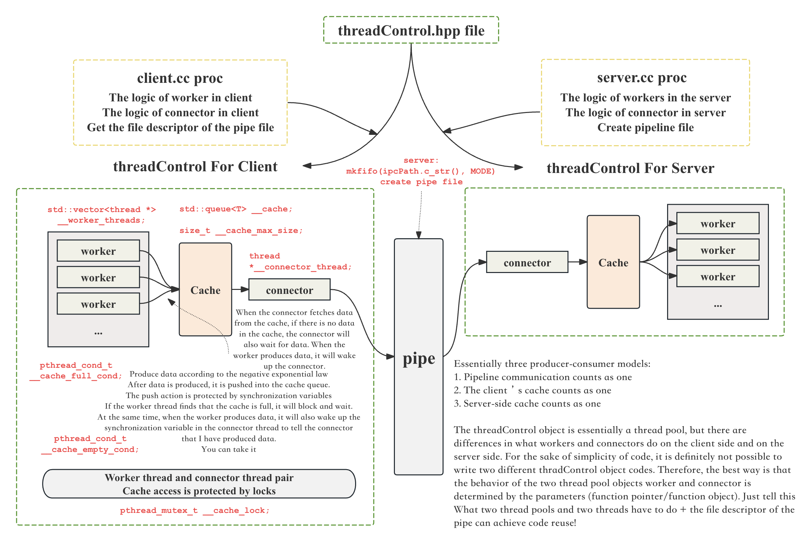
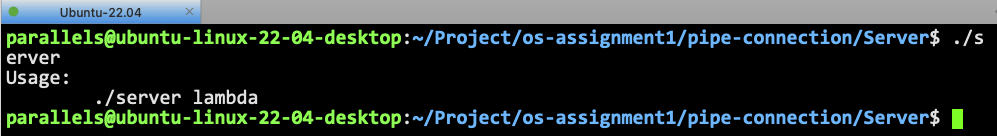

# Dual-Thread-Pool-Based-Pipeline-Communication-System-Framework

- [简体中文](./README-CN.md)
- [English](./README.md)

***

- [Dual-Thread-Pool-Based-Pipeline-Communication-System-Framework](#dual-thread-pool-based-pipeline-communication-system-framework)
  - [Reuse the thread pool method of this project](#reuse-the-thread-pool-method-of-this-project)
  - [Project basic information](#project-basic-information)
  - [Directions in which the project can be optimized](#directions-in-which-the-project-can-be-optimized)
  - [Overall system architecture](#overall-system-architecture)
  - [Project implementation effect](#project-implementation-effect)
    - [Run this project](#run-this-project)
    - [Experiments and analysis of different lambda parameter combinations](#experiments-and-analysis-of-different-lambda-parameter-combinations)
  - [Detailed design of threadControl object](#detailed-design-of-threadcontrol-object)
    - [Q: Why can threadControl objects only use std::string as data in this version? Why are other types not available yet?](#q-why-can-threadcontrol-objects-only-use-stdstring-as-data-in-this-version-why-are-other-types-not-available-yet)
    - [overall design](#overall-design)
    - [Member variables of threadControl](#member-variables-of-threadcontrol)
    - [Member functions of threadControl](#member-functions-of-threadcontrol)
      - [run()](#run)
      - [get\_task()](#get_task)
      - [other member functions](#other-member-functions)
  - [server's and client's worker and connector](#servers-and-clients-worker-and-connector)
    - [server](#server)
    - [client](#client)
  - [lockGuard.hpp RAII style lock wrapper](#lockguardhpp-raii-style-lock-wrapper)
  - [Log.hpp package](#loghpp-package)
  - [comm.hpp](#commhpp)


## Reuse the thread pool method of this project

The thread pool component (threadControl.hpp) object of this project has high maintainability and high code readability. In addition to being used in this project, this component can be used as a thread pool in many other projects.

You can directly view the documentation of the calling method.

- **[reuse-the-threadpool.md](./docs/reuse-the-threadpool.md)**

## Project basic information

This project implements a pipeline communication system framework based on dual thread pools from scratch, which is essentially communication between processes.

**The specific implementation is as follows：**

- For communication between the client and the server, the client randomly generates data, three producer threads (the number can be set through parameters), and one pipeline thread. After the producer thread produces the data, it pushes it to the client's buffer, waits for the pipeline thread to obtain it, and pushes it to the pipeline. The client data is sent to the server process through the pipeline. The server also has three (the number can be set by parameters) consumer threads, one pipeline thread. After the pipeline thread receives the data in the pipeline, it pushes it to the buffer maintained by the server. Distributed to consumer threads for consumption.
- Production and consumption proceed according to the law of negative exponential, and the parameter lambda is specified through the command line parameters of the two processes.
- Manually encapsulate mutex locks and lockGuard objects through RAII style to facilitate locking and unlocking, improve code readability, and improve decoupling. See `./Utils/lockGuard.hpp`.
- The data generated by the producer needs to have process labels and thread labels, so the native thread `pthread_t` is manually encapsulated into a `thread` object, which can include thread information, thread name and other information to facilitate thread management and improve code readability. See `./Utils/thread.hpp`.
- Encapsulate the log function `./Utils/Log.hpp` to distinguish the log levels. Convenient for debugging and debugging.
- Encapsulate the core object of this project `class thread_control`. Essentially a thread pool. Both the client and the server can reuse the code of this object to manage the required threads and the function callbacks corresponding to the threads. At the same time, it can be implemented in one code to manage all mutex locks and mutex synchronization variables of all threads (client or server). **I think this object is the core of this project. It can avoid writing thread control logic separately in the client process and server process, so that the thread control logic is decoupled from the client and server. It greatly reduces the redundancy of the code and greatly improves the secondary development potential of the code. The specific core implementation can be seen in Figure 1 and the description in the first chapter of the article. See `./Utils/threadControl.hpp`. **


## Directions in which the project can be optimized

I welcome everyone to continue optimizing my project. If you want to optimize this project, you can contact my email address (available on my homepage) and then fork this warehouse for optimization. If I think this optimization is OK, I The merge operation will be performed!

- There is currently only one connector thread, which can be optimized. The connector thread is set through parameters.
- The connector thread can be optimized to combine with multiplexing technology. For details, please see my other warehouse, [Multiplexing-high-performance-IO-server](https://github.com/Yufccode/Multiplexing-high-performance-IO -server), monitor multiple file descriptors at the same time. This file descriptor not only comes from pipes, but also from the network, from hardware, etc., so this project can be continuously optimized!
- Optimize the data types supported by the thread pool. Currently, only string types are supported. Because at present, I have not written serialization and deserialization code, so only string/char* types are supported. If this project is to be expanded to a network server or other places, it is necessary to write deserialization and serialization code and maintain a Task class, which can be serialized and deserialized. At the same time, the Task class can overload the operator() method to represent the execution and invocation of the Task task.

## Overall system architecture



## Project implementation effect

### Run this project

clone the repo。

```bash
git clone https://github.com/Yufccode/Dual-Thread-Pool-Based-Pipeline-Communication-System-Framework.git
```

enter the dir.

```bash
cd Dual-Thread-Pool-Based-Pipeline-Communication-System-Framework
```

make.

Executing `make` or `make all` can generate `./Client/client` executable file and `./Server/server` executable file at the same time. Executing `make client` or `make server` will generate the executable files of `client` and `server` respectively.
Executing `make clean` will clean all executable files.

```bash
make clean; make
```

After compilation, open two terminals and enter the Server directory and Client directory respectively. When running, you must specify the parameters of negative index production/consumption, otherwise the program will not run normally. As shown in Figure 3. At the same time, because the pipe is created by the server, the server process must be run first before the client process can be run.



Running the server or client requires passing the lambda parameter.

### Experiments and analysis of different lambda parameter combinations

- **[diff_lambda_test-CN.md](./docs/diff_lambda_test.md)**


## Detailed design of threadControl object

### Q: Why can threadControl objects only use std::string as data in this version? Why are other types not available yet?

The essence of pipeline transmission is the transmission of characters. In this version of the implementation, only the std::string object can be easily converted into a string.

If you want to expand this project to multiple data types, you need to encapsulate the data. The essence of the data is a task, which can be encapsulated into a `Task` class. This `Task` class needs to overload the `operator()` method to represent the task. processing.

The most important thing is to add serialization and deserialization methods to convert the structured Task class into a string type. You can write it manually, or you can use the more commonly used methods now: json or protobuf.

**This is also an area where this project can continue to be optimized. **

### overall design

as the picture shows.


### Member variables of threadControl

It is essentially a thread pool, and the member functions are as follows. **Core: one lock + two synchronization variables. **

```cpp
// The thread pool is essentially a producer-consumer model
template <class T>
class thread_control
{
private:
    std::vector<thread *> __worker_threads;           // worker thread
    int __thread_num;                                 // worker thread number
    std::queue<T> __cache;                            // Task queue, that is, the buffer of 20 slots
    size_t __cache_max_size = CACHE_MAX_SIZE_DEFAULT; // The maximum size of the buffer
    pthread_mutex_t __cache_lock;                     // Multiple threads access buffer lock
    pthread_cond_t __cache_empty_cond;                // Determine whether the buffer is empty
    pthread_cond_t __cache_full_cond;                 // Determine whether the buffer is full
    thread *__connector_thread;                       // connector thread, only one
    int __fd;                                         // fd of pipe file
    double __lambda;                                  // Negative exponential parameter, consumption frequency/production frequency
public:
    bool __quit_signal = false; // Control process ends
    // member functions
    // ...
}
```

- `std::vector<thread *> __worker_threads;` represents a series of worker threads. If it is called by a producer, then these threads are responsible for producing data and then throwing it into the cache maintained by the producer ( `std::queue<T> __cache;`).
- `int __thread_num;` indicates the number of worker threads. This parameter is passed in by the constructor for initialization.
- `size_t __cache_max_size = CACHE_MAX_SIZE_DEFAULT;` The maximum size of the buffer, `CACHE_MAX_SIZE_DEFAULT` is defined in comm.hpp.
- One lock + two synchronization variables. Each tc object maintains a lock to protect multi-thread access to the buffer. Because there are multiple worker threads, and the connector thread will also access the buffer, the buffer is a critical area and needs to be protected by a lock. Synchronization variables: When the tc object buffer maintained by the producer is full, the worker thread cannot continue to add data to the buffer, so thread synchronization is required. At the same time, if the buffer is empty, the connector thread can no longer access it. Data. The same goes for consumers, it’s just the other way around.
- `int __fd;` The file descriptor of the pipeline file. This parameter is passed in by the main function of the producer/consumer through the constructor. For producers, this fd is the writing end of the pipe, and for consumers, this fd is the reading end of the pipe.
- `double __lambda;` The parameter lambda produced/consumed by the producer/consumer according to the negative index, passed through the command line parameter -> constructor.

### Member functions of threadControl

Construction and destruction will not be expanded here, you can look at the code directly. Mainly the initialization and destruction of threads, locks and synchronization variables.

#### run()

```cpp
void run()
{
    __connector_thread->start();
    logMessage(NORMAL, "%s %s", __connector_thread->name().c_str(), "start\n");
    for (auto &iter : __worker_threads)
    {
        iter->start();
        logMessage(NORMAL, "%s %s", iter->name().c_str(), "start\n");
    }
    // Now that all threads have been started, we need to control the exit logic.
    while (1)
        // Now all threads are running
        if (__quit_signal) // Listen for exit signals
            break;
}
```

This method first runs all threads. Of course, I have encapsulated the threads into `thread` type. Calling `thread::start()` is essentially calling `pthread_create()`.
After the thread is started, it needs to monitor the exit signal, let the run() method continue to run, wait for a thread, and send the `__quit_signal` signal before it can stop running.

#### get_task()

```cpp
T get_task()
{
    T t = __cache.front();
    __cache.pop();
    return t; // copy return
}
```

In fact, it is a queue operation, taking tasks (data) out of the queue.

#### other member functions

```cpp
pthread_mutex_t *get_mutex() { return &__cache_lock; }
pthread_cond_t *get_empty_cond() { return &__cache_empty_cond; }
pthread_cond_t *get_full_cond() { return &__cache_full_cond; }
std::queue<T> &get_queue() { return this->__cache; }
void wait_empty_cond() { pthread_cond_wait(&__cache_empty_cond, &__cache_lock); }
void wait_full_cond() { pthread_cond_wait(&__cache_full_cond, &__cache_lock); }
bool is_empty() { return __cache.empty(); }
bool is_full() { return __cache.size() >= __cache_max_size; }
int get_fd() { return this->__fd; }
double get_lambda() { return this->__lambda; }
```

Since some member functions are private, when writing the worker method/connector method to be called by the thread, private member variables cannot be accessed, so a series of external access interfaces are provided here.

## server's and client's worker and connector

### server

**Running process of server worker**

```cpp
void *worker(void *args)
```

First obtain the tc object that calls the worker function through the args parameter.

```cpp
__thread_data *td = (__thread_data *)args;
thread_control<std::string> *tc = (thread_control<std::string> *)td->__args;
```

A data generator for constructing negative exponential distributions.

```
std::random_device rd;
std::mt19937 gen(rd());
std::exponential_distribution<> dist(tc->get_lambda());
```

Then lock it, and then determine whether the synchronization variable meets the conditions, that is, whether the buffer is empty. If there is no data in the buffer, block the thread and wait for server::connector to wake up.
After getting the data (taking it out from the queue), print the data to indicate the processing of the task.

If "quit" is received, it means that the exit signal is received. At this time, `tc->__quit_signal` should be changed to true. This quit is generated from the connector. At this time, the `tc->run()` method is listening Exit signal. After receiving the exit signal, all threads will be organized to end.

**The running process of the server's connector**

Server::connector obtains data from the pipeline, then puts it in the server's cache, waiting for server::worker to process it.

The process is very simple. It also requires the control of locking and synchronization variables. The specific implementation can be seen in the code, which is to push things into the cache.

### client

The client side is opposite to the server side, and the code is basically the same, so I won’t explain it again here.

## lockGuard.hpp RAII style lock wrapper

RAII-style lock encapsulation is basically a common practice in C++/C system programming, and it can basically be regarded as a standard practice. Has the following benefits:

- Only use non-recursive mutex (that is, non-reentrant mutex).
- Instead of manually calling the lock() and unlock() functions, everything is handled by the constructor and destructor of the Guard object on the stack. The lifetime of a Guard object is exactly equal to the critical section.
- Every time when constructing a Guard object, consider the locks already held along the way (on the call stack) to prevent deadlock (deadlock) caused by different locking sequences.
- No cross-process mutex is used, only TCP sockets are used for inter-process communication.
- Locking and unlocking are performed in the same thread. Thread a cannot unlock the mutex that thread b has locked (RAII automatically guarantees). ·Don’t forget to unlock (RAII automatically guaranteed).
- No duplicate unlocking (RAII automatic guarantee).

## Log.hpp package

Define four log levels:

```cpp
#define DEBUG 0
#define NORMAL 1
#define WARNING 2
#define ERROR 3
#define FATAL 4
```

define function

```cpp
void logMessage(int level, const char *format, ...) {}
```

Allows calling with variable parameters. As shown in the following example.

```cpp
logMessage(FATAL, "worker function is nullptr or connector fucntion is nullptr, pid: %d", getpid());
```

It can be set in `#define LOGFILE ""`. If `LOGFILE` is `""`, the log is printed to stdout. If it is a legal path, it is printed to the corresponding file.

## comm.hpp

Some common header files are defined, as well as some global macro parameters that need to be used. Please see the code for details.
