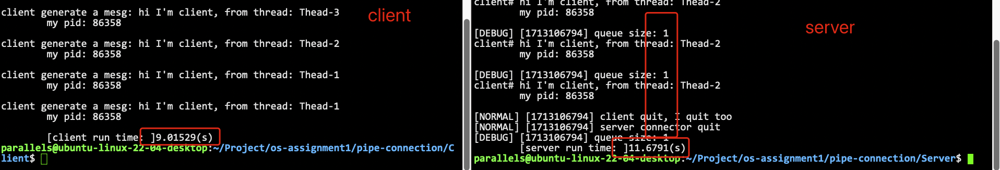
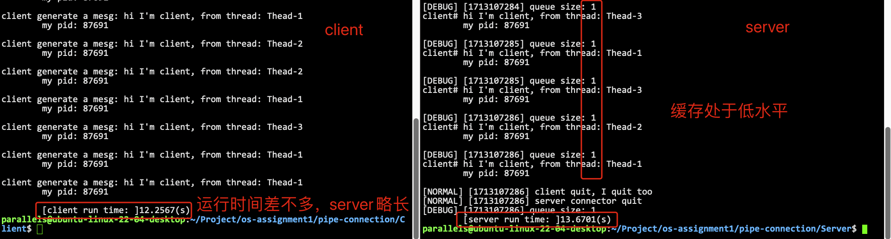
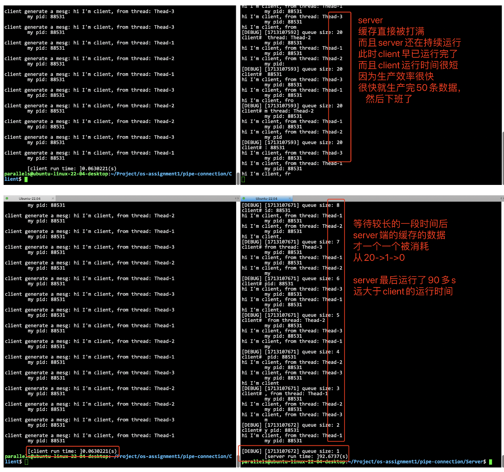

# 不同lambda参数组合实验及其分析

- **[简体中文](./diff_lambda_test-CN.md)**
- **[English](./diff_lambda_test.md)**

在负指数分布中，如果参数越大，则表示 C++11 生成器生成的数字越小，则表示 sleep() 的时间越 小，表示事件越频繁。
其次，我设置的逻辑是，server 端会在 client 关闭了写端描述符后，才会退出。
其三，我设置的逻辑是，client 端在发送 50 条消息后，自行退出(这个数字可以在配置文件更改，设 置的数字需要大于 20，缓冲区的大小，这样后面能看到缓冲区被打满的情况)。

## 如果 Server 的 lambda 大于或等于 Client 的 lambda

此时，消费效率在宏观来看一定是大于/等于生产效率的。此时应该会出现的现象为：server 端的缓存不会被打满，而且会一直处于一个低水平的状态，因为 client 生产的很慢，通过管道过来 server 的数据会 非常少，而消费效率非常高，所以 server 缓存中的消息数量会很少。其实通俗来说:就是供不应求，东西 会被立刻抢光，什么时候发布，什么时候卖完，所以 server 和 client 的运行时间不会差很远。

如图 Server 端 lambda 为 10，Client 端为 1

如图 Server 端 lambda 为 1，Client 端为 1

可以看到，server 缓存一直处于一个低水平状态，其次，client 运行时间和 server 是差不多的，因为 server 端关闭，一定是 client 端已经关闭文件描述符了，也就是已经发送完 50 条消息了，因此退出。而 与此同时，server 端缓冲区处于低水平，因此 server 的 worker 不需要花长时间处理完剩下 server 缓冲区中的内容。

**因此可以得出结论：如果 Server 的 lambda 大于或等于 Client 的 lambda，server 的运行时间，会比 client 略长一个任务的处理时间(即一个任务从管道写端开始，到被 server 端的 worker 线程处理完毕这 一段时间)。**

## 如果 Server 的 lambda 小于 Client 的 lambda

**此时，消费效率小于生产效率的。此时应该会出现的现象为:server 端的缓存会被打满!因为 client 生产的太快了，通过管道过来 server 的数据会非常多，而消费效率非常小，所以 server 缓存中的消息数 量会很非常多，当然 server 缓存被打满之后，connector 线程也会被阻塞(因为有互斥同步变量存在)，此 时甚至连管道，都有可能被打满，造成程序崩溃，所以在这个实验里面，我把管道大小设置为一个足够的 值，方便我们观察 server 缓存被打满的情况。其实通俗来说:就是供大于求，东西会堆积，发布完之后， 很长时间，才能被消耗完!**

如图 此时 Server 端 lambda 为 1，Client 端为 10 此时的情况也是符合预期，缓冲区被打满，server 跑半天跑不出来。